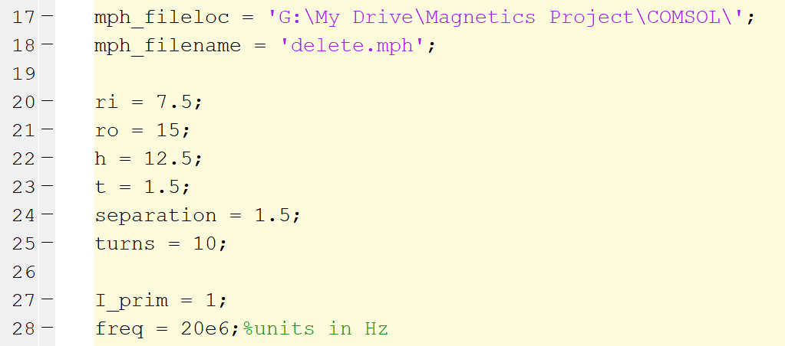

# Basic Toroidal Inductor Modeling

##### Author: Zikang Tong
##### Description:
This folder contains documents and files instructing the user how to model a 3-D printed toroidal inductor in COMSOL. 
**To start, you must open the COMSOL Multiphysics 5.4a with MATLAB application.**

### Scripting Tutorial
The script [toroidal_inductor.m](toroidal_inductor.m) contains the code used to retrieve the AC impedance of a toroidal inductor with square cross-section. The user sets the parameters shown below.

The first line, **mph_fileloc**, specifies the folder path of where to save the .mph file generated by the script. The second line, **mph_filename**, specifies the filename of the .mph file. Note that the filename **MUST** end with .mph.

**ri** refers to the inner radius of the toroid.

**ro** refers to the outer radius.

**h** refers to the height of the toroid.

**t** refers to the thickness of the toroid. Note that the structure is hollow so the thickness determines the structural robustness of the print.

**separation** refers to the distance spacing between each winding. This determines the voltage isolation capabilities of the structure.

**turns** refers to number of turns.

All units are in mm and below shows a figure of a toroidal inductor with the parameters labeled.
