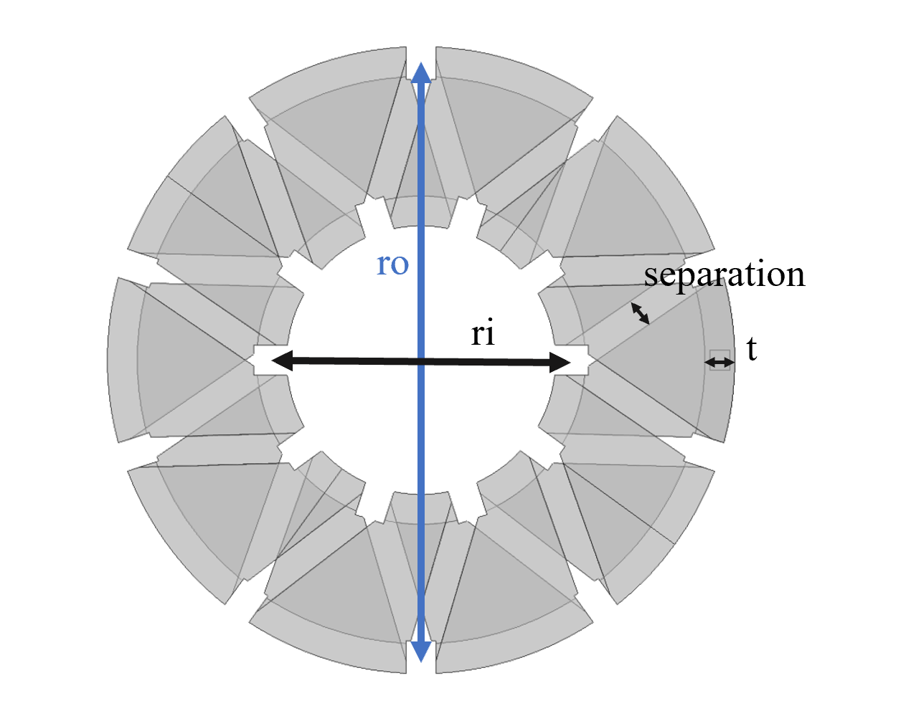
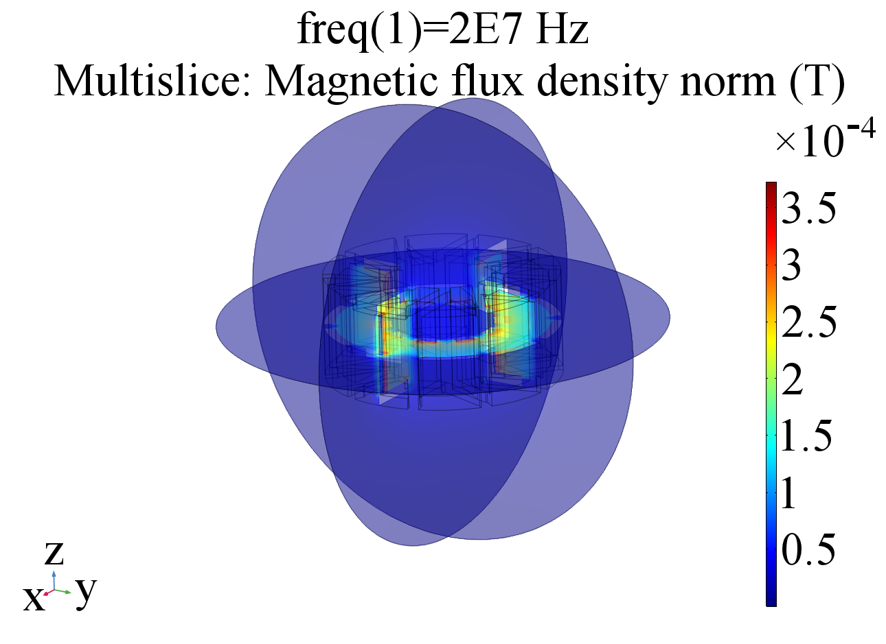

# Basic Toroidal Inductor Modeling

##### Author: Zikang Tong
##### Description:
This folder contains documents and files instructing the user how to model a 3-D printed toroidal inductor in COMSOL. 
**To start, you must open the COMSOL Multiphysics 5.4a with MATLAB application.**

## Script Usage Tutorial
The script [toroidal_inductor.m](toroidal_inductor.m) contains the code used to retrieve the AC impedance of a toroidal inductor with square cross-section. The user sets the parameters shown below.

```
mph_fileloc = 'G:\My Drive\Magnetics Project\COMSOL\';^M
mph_filename = 'delete.mph';

ri = 7.5; 
ro = 15;
h = 12.5;
t = 1.5;
separation = 1.5;
turns = 10;

I_prim = 1;
freq = 20e6;%units in Hz
```

### Toroid Geometry Initialization
The first line, **mph_fileloc**, specifies the folder path of where to save the .mph file generated by the script. The second line, **mph_filename**, specifies the filename of the .mph file. Note that the filename **MUST** end with .mph.

**ri** refers to the inner radius of the toroid.

**ro** refers to the outer radius.

**h** refers to the height of the toroid.

**t** refers to the thickness of the toroid. Note that the structure is hollow so the thickness determines the structural robustness of the print.

**separation** refers to the distance spacing between each winding. This determines the voltage isolation capabilities of the structure.

**turns** refers to number of turns.

All units are in mm and below shows a figure of a toroidal inductor with the parameters labeled.

 

### Simulation Parameters Initialization
For simulation, the toroid is injected by a lumped port current source with amplitude **I_prim** and frequency of **freq**. The units are in A and Hz. 

### Simulation Results
Once these parameters are initialized, you are ready to run the simulation by pressing the green run button. After the script has completed running, it outputs 2 variables, **Z_imag**, which is the imaginary component of the impedance in Ohms and **Z_real**, the real component. These variables can be used to determine the AC losses as well as the inductance of the structures (assuming the frequency is not close to resonance).

Furthermore, you can also retrieve 3D FEM plots from this simulation. To do so, open the .mph file generated by the script. In the **Model Builder** window, open the **Results** tab and click on the **Magnetic Flux Density Norm (mf)** tab, which will lead you to the simulation plot.


By default, you will get a simulation window displaying the 3-D spatial B-field distribution within the boundary. Note that because we are running a **Magnetic Fields (mf)** simulation and not a **Magnetic and Electric Fields (mef)** simulation, we will not get any detailed field distribution within the conductive layer. All magnetic and electrical behavior of conductor will be modeled at the surface. We can also obtain the surface current distribution of the structure. To do so, create a copy of the original dataset. Then, choose the selection to be only the conductive boundaries (**Explicit 4**). Then, create another 3D plot, plotting the surface and selecting the second solution which has the selection. Plot **mf.normJs**. Below shows the plots of the B-field and the surface current density.


